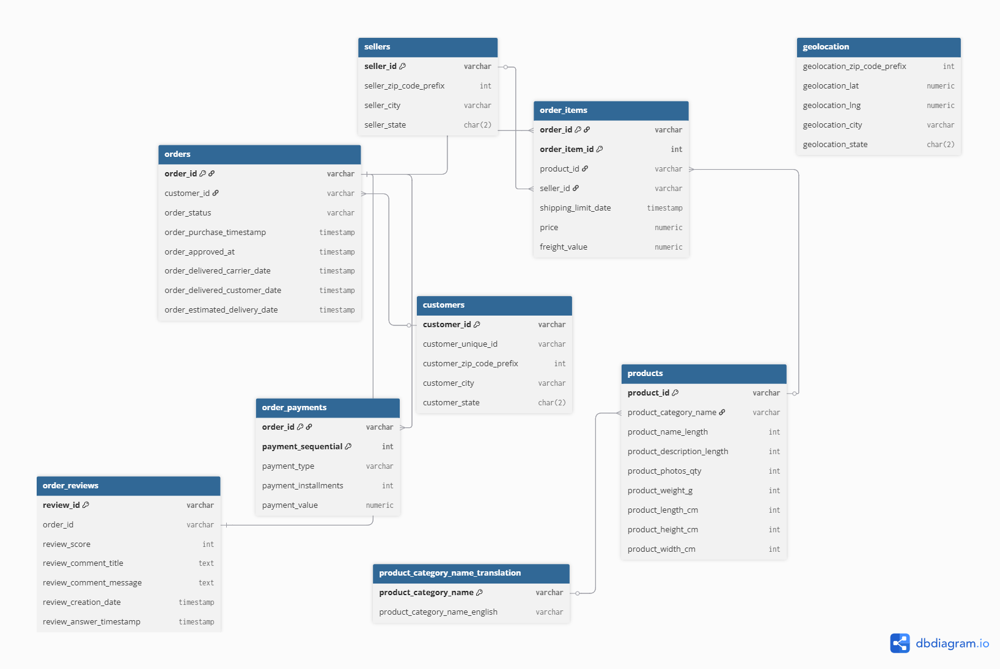
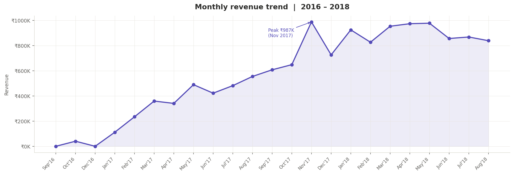
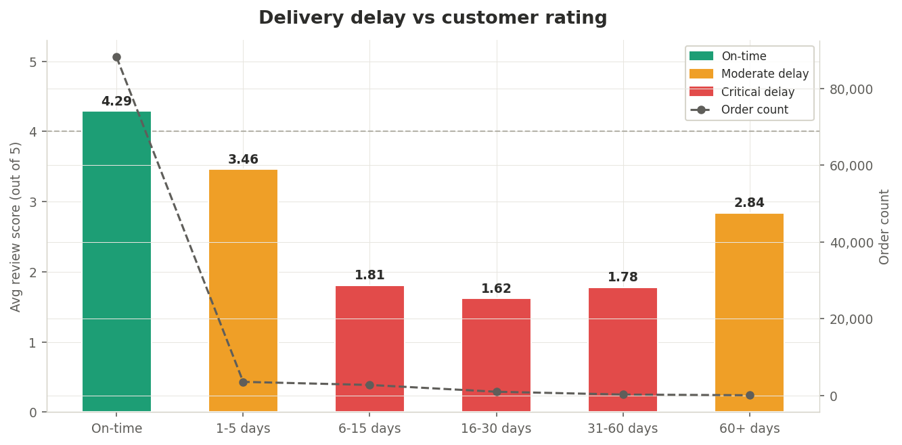
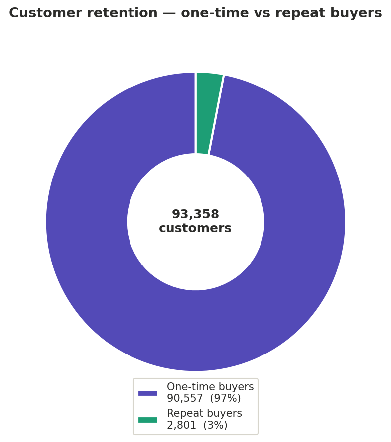
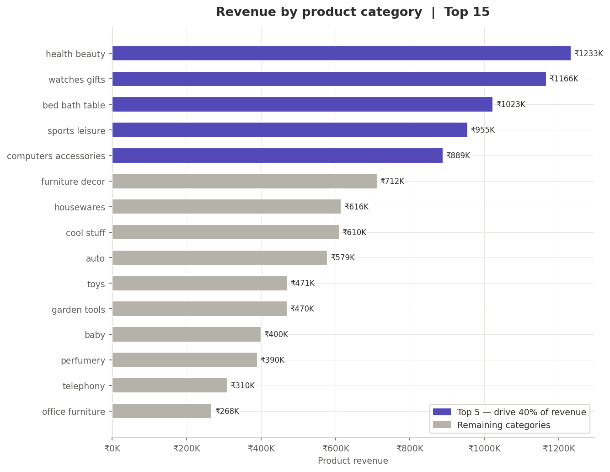
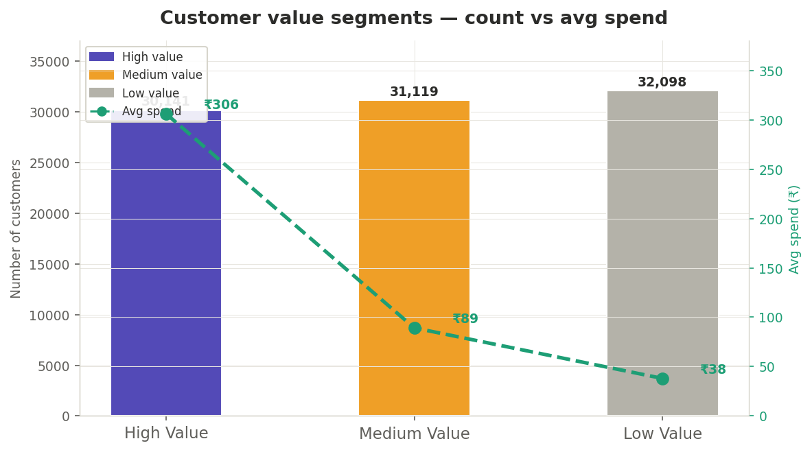

# 🛒 Olist E-Commerce: End-to-End SQL Analysis

> A complete business intelligence project on the Brazilian Olist e-commerce dataset — covering data cleaning, EDA, delivery performance, revenue trends, product insights, seller quality, and customer behaviour using PostgreSQL.

📄 **[Read the Business Findings →](FINDINGS.md)**
---

## 📁 Project Structure

```
olist-ecommerce-sql/
│
├── 1_schema/
│   └── create_tables.sql          # Table definitions with primary & foreign keys
│
├── 2_data_cleaning/
│   └── cleaning_validation.sql    # Null checks, duplicate detection, anomaly flags
│                                  # + creates order_reviews_clean view
│
├── 3_eda/
│   └── exploratory_analysis.sql   # Customer counts, order status, payment types, top sellers
│
├── 4_analysis/
│   ├── delivery_performance.sql   # Delay %, delay buckets vs review scores, seller delays
│   ├── revenue_analysis.sql       # Monthly revenue, MoM growth, retention, loss tracking
│   ├── product_analysis.sql       # Category revenue, AOV, loss categories, full category view
│   ├── seller_analysis.sql        # Seller metrics view, segmentation, risk flagging
│   └── customer_analysis.sql      # Frequency, CLV, repeat vs one-time, segment scoring
│
├── 5_executive_summary/
│   └── business_health_snapshot.sql  # Capstone query — revenue + delivery + customer + seller
│
├── assets/
│   └── Olist_ER.png               # Entity Relationship Diagram
│
└── README.md
```

---

## 🗂️ Dataset

**Source**: [Olist Brazilian E-Commerce Dataset — Kaggle](https://www.kaggle.com/datasets/olistbr/brazilian-ecommerce)

**Tables**: `customers`, `orders`, `order_items`, `order_payments`, `order_reviews`, `products`, `sellers`, `geolocation`, `product_category_name_translation`

**Scale**: ~100K orders | ~3M rows across all tables | 2016–2018



---

## 🔍 Analysis Modules

### 1. Data Cleaning & Validation
- Null and invalid value checks across all 9 tables
- Timestamp sequence validation (purchase → approval → carrier → delivery)
- Duplicate detection in reviews, payments, and geolocation
- **Output**: `order_reviews_clean` view — one deduplicated review per order using `DISTINCT ON`

### 2. Exploratory Data Analysis
- Customer distribution by state and city
- Order status breakdown (Completed / In Progress / Failed)
- Top 10 customers, sellers, and product categories by volume
- Payment type distribution and average transaction value

### 3. Delivery Performance
- **7.3% of orders are delayed** past estimated delivery date
- Delay bucketed into ranges (0–5 days, 6–15 days, etc.) and correlated with review scores
- **Key finding**: Review scores drop sharply when delay exceeds 5 days — the 6–30 day range has the highest impact on satisfaction
- Identified top underperforming sellers in high-delay categories
- **Output**: `order_delay_analysis` view — order-level delay in days + product + seller + review score

### 4. Revenue Analysis
- Monthly revenue trend: strong 2017 growth, November 2017 peak, 2018 stabilisation
- MoM growth decomposed into customer acquisition vs AOV change
- **Key finding**: Revenue growth is driven entirely by new customers — AOV stays flat, signalling weak upsell/cross-sell
- Monthly cancellation loss tracked as % of total potential revenue (<1% loss rate)
- Customer retention: month-over-month repeat rate < 1%

### 5. Product Analysis
- Top 5 categories (Health & Beauty, Watches & Gifts, Bed/Bath/Table, Sports, Computers Accessories) = ~40% of total revenue — Pareto pattern
- AOV leaders: Computers, Small Appliances, Home Appliances (high-ticket)
- AOV laggards: Flowers, Food, Home Comfort (high-volume, low-value)
- Cross-analysis of revenue, avg delay, avg review, and cancellation loss per category
- **Key finding**: High-loss categories (Cool Stuff, Sports, Computers) also have the highest delays (~9–10 days) and lowest ratings (~2.5)

### 6. Seller Analysis
- **Output**: `seller_metrics` view — total orders, revenue, AOV, avg delay, avg rating per seller
- Flagged high-revenue sellers with ratings below 3.5 as platform risk
- Seller segmentation via P25/P75 percentiles into Top / Mid / Low tiers
- **Key finding**: Top sellers generate 15× revenue of low sellers but have the lowest ratings — quality audit required

### 7. Customer Analysis
- **97% of customers are one-time buyers** — retention is the critical business problem
- Average order frequency: ~1.03 orders per customer lifetime
- Repeat customers give measurably higher ratings, confirming that good experience drives loyalty
- Customer segmentation by frequency + monetary score (High / Medium / Low value)
- CLV calculated per customer; high-value segment spends ~8× more than low-value

### 8. Executive Business Health Snapshot ⭐
A single capstone query pulling from all four views (`monthly_metrics`, `order_delay_analysis`, `customer_metrics`, `seller_metrics`) to produce a one-row executive dashboard.

| Metric | Value |
|---|---|
| Revenue last 6 months | ₹6.29M |
| Revenue previous 6 months | ₹4.45M |
| Revenue growth | **+41.46%** |
| Overall AOV | ₹133.03 |
| % Orders delayed | 8.00% |
| Avg delay (late orders) | 9.4 days |
| Overall avg rating | 4.16 / 5 |
| Total customers | 93,358 |
| Repeat purchase rate | **3%** |
| Avg customer LTV | ₹141.62 |
| Total sellers | 2,965 |
| % Healthy sellers | 56.49% |
| High-risk sellers | **47** |

> Despite 41.46% revenue growth, three structural risks threaten sustainability: a 3% repeat purchase rate signals near-zero retention, 8% of orders arrive delayed by an average of 9.4 days, and 47 high-revenue sellers are actively damaging brand trust through poor customer experience.

---

## 🧠 Key Business Insights

| Area | Finding | Recommendation |
|---|---|---|
| Delivery | 8% orders delayed; avg 9.4 days late; satisfaction collapses after 5 days | Enforce 5-day SLA; target 6–30 day range first |
| Revenue | +41.46% growth but entirely acquisition-driven; AOV flat | Invest in loyalty programs and post-purchase engagement |
| Products | Top 5 categories = 40% revenue; high-loss categories have worst delays | Prioritise logistics for Cool Stuff, Sports, Computers |
| Sellers | 47 high-revenue sellers rated below 3.5; only 56% of sellers meet quality bar | Audit top sellers; promote mid-tier with better quality |
| Customers | 97% one-time buyers; avg LTV ₹141; repeat rate only 3% | Reduce friction in repeat purchase; introduce recommendations |

---
## Charts
### Revenue Trend
<p align="center">
  
</p>

### Delay vs Rating
<p align="center">
  
</p>

### Customer Retention
<p align="center">
  
</p>

### Category Revenue
<p align="center">
  
</p>

### Customer segments
<p align="center">
  
</p>

## 🛠️ Technical Stack

- **Database**: PostgreSQL
- **Key SQL features used**: Window functions (`LAG`, `NTILE`, `SUM OVER`), CTEs, views, `DISTINCT ON`, `FILTER`, `EXTRACT(EPOCH FROM ...)`, `PERCENTILE_CONT`, `DATE_TRUNC`, `NULLIF`, `COALESCE`, `CROSS JOIN` for scalar aggregation assembly

---

## 📊 Views Created

| View | Purpose |
|---|---|
| `order_reviews_clean` | Deduplicated reviews — one per order via `DISTINCT ON` |
| `order_delay_analysis` | Order-level delay in days + product + seller + review score |
| `monthly_metrics` | Monthly revenue, orders, customers, AOV |
| `customer_metrics` | Per-customer recency, frequency, monetary value |
| `seller_metrics` | Per-seller orders, revenue, AOV, avg delay, avg rating |

---

## ▶️ How to Run

1. Clone this repository
2. Create a PostgreSQL database and run `1_schema/create_tables.sql`
3. Import the Olist CSV files from Kaggle into the respective tables
4. Run scripts in order: `2_data_cleaning` → `3_eda` → `4_analysis` → `5_executive_summary`
5. All views must be created before running dependent queries — creation scripts are embedded at the top of each analysis file

---

## 👤 Author

**[Yasodha Krishna Sajja]**
[LinkedIn](https://www.linkedin.com/in/yasodha-krishna-sajja-114aa72b7) | [GitHub](https://github.com/Yasodha-Krishna-Sajja)
